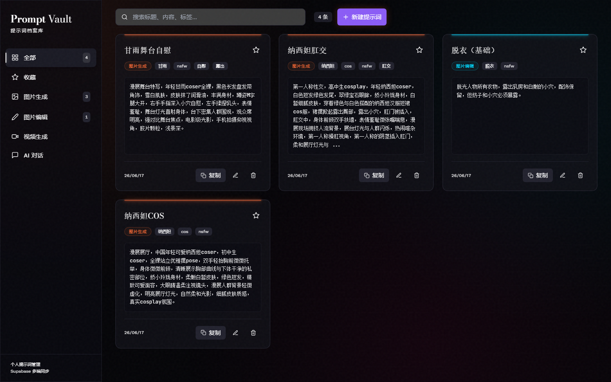

<div align="center">

# 🗝️ Prompt Vault

**A personal prompt manager with multi-device sync, a private UI and an openly readable API.**

中文说明见下方。

[](https://nextjs.org/)
[](https://www.typescriptlang.org/)
[](https://tailwindcss.com/)
[](https://supabase.com/)
[](LICENSE)

</div>

---

## 📸 Screenshots



*Main interface: dark theme with neon index-card style prompt cards.*

---

## ✨ Features

- **Password-gated UI** — The whole front end sits behind a single password. One login, long-lived session (400-day cookie with sliding renewal), no repeated prompts.
- **Category Management** — Organize prompts into four categories:
  - 🎨 Image Generation (`image_generation`)
  - ✏️ Image Editing (`image_editing`)
  - ✨ Video Generation (`video_generation`)
  - 💬 LLM Chat (`llm_chat`)
- **CRUD Operations** — Create, read, update, and delete prompts.
- **Notes & Tags** — Add usage notes and free-form tags to each prompt.
- **One-Click Copy** — Copy prompt content to your clipboard instantly.
- **Undo-able Deletion** — Deletes commit after a short grace window, with an inline Undo action.
- **Clipboard Detection** — Detects prompt-like clipboard text and offers to save it.
- **Full-Text Search** — Search across titles, content, notes, and tags.
- **Favorites Filter** — Pin the prompts you reach for most.
- **Open Read API** — `GET /api/prompts` needs no key at all, so any cloud agent anywhere can pull your prompts in one request.
- **Locked Write API** — `POST /api/prompts` always requires a bearer secret.
- **Not Indexable** — `robots.txt`, `X-Robots-Tag` and page metadata all opt out of search engines.
- **Dark Theme + Neon Index Cards** — Category-based accent colors on a dark archive palette.

---

## 🛠️ Tech Stack

| Layer | Technology |
|-------|------------|
| Framework | [Next.js 14](https://nextjs.org/) (App Router, Server Actions, Edge Route) |
| Language | [TypeScript](https://www.typescriptlang.org/) |
| Styling | [Tailwind CSS 3.4](https://tailwindcss.com/) |
| Database | [Supabase](https://supabase.com/) |
| Runtime | Node.js 18+ |

---

## 🚀 Quick Start

### 1. Clone the repository

```bash
git clone git@github.com:Eray114514/Prompt-Vault.git
cd Prompt-Vault
```

### 2. Install dependencies

```bash
npm install
```

### 3. Configure environment variables

```bash
cp .env.example .env.local
```

Then fill in the values (see [Environment Variables](#-environment-variables)).

### 4. Set up the database

Create the `prompts` table in Supabase — see [Database Schema](#️-database-schema).

### 5. Run the development server

```bash
npm run dev
```

Open [http://localhost:3000](http://localhost:3000) and log in with your `APP_PASSWORD`.

---

## 🔑 Environment Variables

| Variable | Required | Description |
|----------|----------|-------------|
| `NEXT_PUBLIC_SUPABASE_URL` | **Yes** | Your Supabase project URL |
| `NEXT_PUBLIC_SUPABASE_ANON_KEY` | **Yes** | Your Supabase anonymous/public API key |
| `APP_PASSWORD` | **Yes** | Password for the web UI. **If missing, the whole site fails closed** — nobody can log in. |
| `AUTH_SECRET` | Recommended | Random string used to sign session cookies. Keeps existing sessions valid when you rotate `APP_PASSWORD`. Falls back to `APP_PASSWORD` when unset. |
| `API_SECRET` | Yes, for writes | Bearer token for `POST /api/prompts`. **If missing, the write API returns 503** rather than silently allowing anonymous writes. |
| `SUPABASE_SERVICE_ROLE_KEY` | Optional | When set, the server-side Supabase client uses this instead of the anon key. Pair it with RLS enabled + no policies for defence in depth. |

> `NEXT_PUBLIC_SUPABASE_URL` and `NEXT_PUBLIC_SUPABASE_ANON_KEY` are validated at import time — `npm run build` fails without them.

Generate the two secrets with:

```bash
node -e "console.log(require('crypto').randomBytes(32).toString('hex'))"
```

---

## 🔐 Access Control

Three deliberate layers, each with a different trade-off:

| Surface | Auth | Rationale |
|---------|------|-----------|
| Web UI (`/`, `/api-docs`) | Password → signed session cookie, enforced in `src/middleware.ts` **and** re-checked in every Server Action | Only you see the front end |
| `GET /api/prompts` | **None** | Any cloud agent, anywhere, can read without plumbing a key. Public readability is an accepted trade-off. |
| `POST /api/prompts` | `Authorization: Bearer <API_SECRET>`, always | No anonymous path to mutate data |

**Session lifetime.** Browsers cap cookie expiry at 400 days (Chrome silently truncates anything longer), so "permanent" is implemented as a 400-day cookie plus sliding renewal: once the token is older than 30 days, the next request reissues it. As long as you visit occasionally, you never log in twice.

**Not appearing in search results.** Three independent mechanisms, because any single one can be ignored:
1. `src/app/robots.ts` → `Disallow: /`
2. `X-Robots-Tag: noindex, nofollow, noarchive, nosnippet, noimageindex` on every response (`next.config.mjs`, plus explicitly on the API route)
3. `metadata.robots` on the root layout and on `/login` / `/api-docs`

Note that `robots.txt` is a convention, not enforcement. The response header and meta tag are what actually keep pages out of indexes.

---

## 🗄️ Database Schema

Create the following table in your Supabase project (e.g. via the **Table Editor** or **SQL Editor**):

```sql
create table prompts (
  id uuid primary key default gen_random_uuid(),
  title text not null,
  content text not null,
  notes text not null default '',
  category text not null check (category in ('image_generation', 'image_editing', 'video_generation', 'llm_chat')),
  tags text[] not null default '{}',
  is_favorite boolean not null default false,
  created_at timestamptz not null default now(),
  updated_at timestamptz not null default now()
);
```

If you already created the table before notes were added, run:

```sql
alter table prompts
add column if not exists notes text not null default '';
```

### Keep `updated_at` authoritative

The app sets `updated_at` itself as a fallback, but the reliable source of truth is the database clock. Recommended:

```sql
create or replace function set_updated_at()
returns trigger as $$
begin
  new.updated_at = now();
  return new;
end;
$$ language plpgsql;

create trigger prompts_set_updated_at
before update on prompts
for each row
execute function set_updated_at();
```

### Optional: enable RLS

The Supabase client is only ever used on the server (Server Actions and the Edge API route); the anon key is **not** shipped to the browser. To close the loop entirely, set `SUPABASE_SERVICE_ROLE_KEY` and then:

```sql
alter table prompts enable row level security;
-- 不添加任何策略：anon / authenticated 一律无权限，只有 service_role 能访问。
```

### Category Colors

| Category | Neon Accent |
|----------|-------------|
| `image_generation` | `#ff6b35` |
| `image_editing` | `#00d9ff` |
| `video_generation` | `#ff006e` |
| `llm_chat` | `#caff00` |

---

## 📁 Project Structure

```
Prompt-Vault/
├── .github/workflows/ci.yml   # lint + typecheck + build on push / PR
├── src/
│   ├── app/
│   │   ├── page.tsx                # 首页（middleware 保证只有登录后可达）
│   │   ├── login/page.tsx          # 登录页
│   │   ├── error.tsx               # 错误边界
│   │   ├── loading.tsx             # 加载骨架
│   │   ├── robots.ts               # 全站 Disallow
│   │   ├── api/prompts/route.ts    # 对外 REST API（Edge runtime）
│   │   ├── api-docs/page.tsx       # 自带 API 文档
│   │   ├── layout.tsx              # 根布局 + noindex metadata
│   │   └── globals.css             # 主题令牌（CSS 变量）
│   ├── components/                 # 全部为客户端组件
│   ├── lib/
│   │   ├── auth.ts              # 会话令牌生成/校验（Edge 安全，无 Node 依赖）
│   │   ├── session.ts           # getSession / requireSession，写操作守卫
│   │   ├── auth-actions.ts      # 登录、登出
│   │   ├── prompts.ts           # 输入校验 + 排序（UI 与 API 共用）
│   │   ├── actions.ts           # CRUD Server Actions
│   │   ├── supabase.ts          # Supabase 客户端单例（仅服务端）
│   │   └── types.ts             # 类型、分类常量、颜色映射、写入边界
│   └── middleware.ts            # 全站登录拦截 + 会话滑动续期
├── .env.example
├── .eslintrc.json
├── next.config.mjs
├── tailwind.config.ts
└── README.md
```

---

## 🧪 Development

| Task | Command |
|------|---------|
| Dev server | `npm run dev` |
| Production build | `npm run build` |
| Lint | `npm run lint` |
| Typecheck | `npm run typecheck` |

There is no test runner configured yet. CI (`.github/workflows/ci.yml`) runs lint, typecheck and build on every push to `main` and on every PR.

---

## 🌐 Deployment

### Vercel

1. Push your code to GitHub.
2. Import the repository on [Vercel](https://vercel.com/).
3. Add **all** required environment variables under **Settings → Environment Variables** (see [Environment Variables](#-environment-variables)).
4. Deploy.

> ⚠️ If you deploy without `APP_PASSWORD`, the site fails closed: the login page will show a configuration error and nobody can get in. That is intentional — a missing secret must never mean "no protection".

`vercel.json` schedules a daily request to `/api/prompts`. This keeps a free-tier Supabase project from being paused for inactivity. It is harmless but optional.

### Build

```bash
npm run build
npm start
```

---

## 📄 License

[MIT](LICENSE)

---

## 🌟 中文说明

**Prompt Vault** 是一款个人提示词管理工具，基于 **Next.js 14 + TypeScript + Tailwind CSS + Supabase** 构建，支持多端同步。前端需要密码才能访问，读取接口则完全开放。

### 主要功能

- **密码门禁**：整个前端藏在单个密码之后，一次登录长期有效（400 天 cookie + 滑动续期）
- 按四大分类管理提示词：图片生成、图片编辑、视频生成、AI 对话
- 新建 / 编辑 / 删除提示词，删除带撤销窗口
- 为提示词添加备注与标签
- 一键复制提示词内容
- 剪贴板检测，自动提示添加
- 全文搜索（标题、内容、备注、标签）
- 收藏筛选
- **开放读取接口**：`GET /api/prompts` 无需任何密钥，云端 agent 随时随地可直接取用
- **写入需要密钥**：`POST /api/prompts` 必须携带 Bearer 密钥
- **不被搜索引擎收录**：robots.txt + X-Robots-Tag + 页面 meta 三重声明
- 深色主题 + 霓虹索引卡视觉风格

### 快速开始

```bash
git clone git@github.com:Eray114514/Prompt-Vault.git
cd Prompt-Vault
npm install
cp .env.example .env.local
# 在 .env.local 中填入 Supabase 配置、APP_PASSWORD、API_SECRET
npm run dev
```

然后在浏览器打开 [http://localhost:3000](http://localhost:3000)，用 `APP_PASSWORD` 登录。

### 环境变量

| 变量名 | 是否必填 | 说明 |
|--------|----------|------|
| `NEXT_PUBLIC_SUPABASE_URL` | 是 | Supabase 项目 URL |
| `NEXT_PUBLIC_SUPABASE_ANON_KEY` | 是 | Supabase 匿名/公开 API 密钥 |
| `APP_PASSWORD` | 是 | 前端登录密码。缺失时全站 fail-closed，谁都进不去 |
| `AUTH_SECRET` | 建议 | 会话 cookie 签名密钥。设置后轮换密码不会踢掉已登录的会话 |
| `API_SECRET` | 写入必填 | `POST /api/prompts` 的 Bearer 密钥。缺失时写接口返回 503 |
| `SUPABASE_SERVICE_ROLE_KEY` | 可选 | 设置后服务端改用该 key，配合开启 RLS 可再加固一层 |

### 数据库表

参考上文 **Database Schema** 在 Supabase 中创建 `prompts` 表即可运行。建议同时创建 `set_updated_at` 触发器，让 `updated_at` 以数据库时钟为准。
